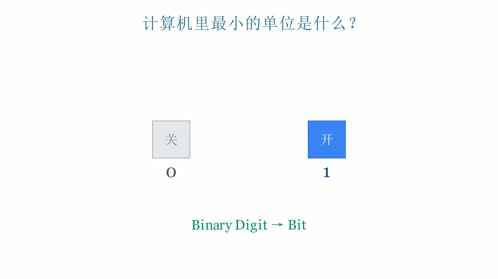

# 计算机中的 Bit - 教育动画视频

> 用 Manim 制作的计算机基础知识教育短视频，讲解 Bit、Byte、二进制等核心概念。

[](https://github.com/yourusername/bit-demo)

## 📹 视频预览

这是一个 20 秒的教育短视频，用直观的动画讲解计算机最基础的单位——Bit（比特）。

### 内容大纲
1. **提问引入** (0-3s) - "计算机里最小的单位是什么？"
2. **开关隐喻** (3-8s) - 用开关形象化 0 和 1
3. **Bit 定义** (8-11s) - Binary Digit → Bit
4. **组合威力** (11-14s) - 2 bits 组合出 4 种状态
5. **实际应用** (14-18s) - 8 bits = 1 Byte，可表示字母 A
6. **金句总结** (18-21s) - "万物皆由 0 和 1 构成"

## 🚀 快速开始

### 环境要求
- Python 3.12+
- FFmpeg
- uv (推荐) 或 pip

### 安装依赖

```bash
# 使用 uv（推荐）
uv venv .venv
source .venv/bin/activate  # Linux/Mac
# 或 .venv/Scripts/activate  # Windows

# 安装依赖
uv pip install manim edge-tts pydub srt
```

### 生成视频

```bash
# 1. 渲染动画
.venv/Scripts/manim -pqh bit_demo.py BitExplained

# 2. 添加配音和字幕（可选）
.venv/Scripts/python add_styled_audio.py

# 3. 嵌入封面（可选）
.venv/Scripts/python embed_cover.py
```

## 📁 项目结构

```
bit-demo/
├── bit_demo.py              # Manim 动画源码
├── add_styled_audio.py      # 配音+字幕脚本
├── embed_cover.py           # 封面嵌入脚本
├── pyproject.toml           # 项目配置
├── requirements.txt         # 依赖清单
├── start.md                 # 原始需求文档
├── doc/
│   └── audio.md             # 配音技术文档
├── thumbnails/              # 封面候选图
│   ├── cover_01_title.jpg
│   ├── cover_02_switch.jpg  # 推荐封面
│   ├── cover_03_bits.jpg
│   └── cover_04_summary.jpg
└── media/                   # 输出目录（gitignore）
```

## 🎨 技术栈

| 环节 | 工具 | 说明 |
|------|------|------|
| 动画渲染 | [Manim](https://github.com/ManimCommunity/manim) | 数学动画引擎 |
| 配音合成 | [edge-tts](https://github.com/rany2/edge-tts) | 微软语音合成 |
| 字幕处理 | [pydub](https://github.com/jiaaro/pydub) + [srt](https://github.com/cdown/srt) | 时间轴对齐 |
| 音画合成 | [FFmpeg](https://ffmpeg.org/) | 视频处理 |
| 包管理 | [uv](https://github.com/astral-sh/uv) | 快速 Python 包管理 |

## 📝 关键知识点

### 什么是 Bit？

**Bit**（比特）是计算机中最小的信息单位，取值为 **0** 或 **1**。

- **0** = 关（灰色方块）
- **1** = 开（蓝色方块）

### 组合原理

| Bit 数量 | 可能组合 | 可表示范围 |
|---------|---------|-----------|
| 1 bit | 2 种 (0, 1) | 0-1 |
| 2 bits | 4 种 (00, 01, 10, 11) | 0-3 |
| 8 bits | 256 种 | 0-255 (1 Byte) |

### Byte 与字符

8 bits = 1 Byte，可以表示一个字符（如字母 A）。

## 🤝 贡献

欢迎提交 Issue 或 PR！如果你有好的教育视频创意，可以：

1. Fork 本仓库
2. 创建新的动画场景（如 `cpu_demo.py`）
3. 提交 PR 分享你的想法

## 📄 许可

MIT License - 自由使用，欢迎传播知识！

---

> **提示**：由于视频文件较大，本项目使用 Git LFS 或仅在 README 中展示封面。完整视频请查看 [Releases](https://github.com/yourusername/bit-demo/releases)。
